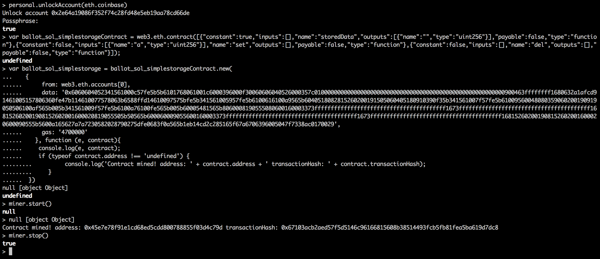

#### 智能合约实战(一)

**作者：李康**

##### 1. 搭建以太坊私链

使用 `geth` 客户端搭建以太坊私链，首先定制私链的创世区块文件 -- `genesis.json` 文件，如下:

```
{
	"config": {
        "chainId": 15,
        "homesteadBlock": 0,
        "eip155Block": 0,
        "eip158Block": 0
    },
	"nonce": "0x0000000000000042",
	"timestamp": "0x00",
	"parentHash": "0x0000000000000000000000000000000000000000000000000000000000000000",
	"extraData": "0x00",
	"gasLimit": "0x08000000",
	"difficulty": "0x020000",
	"mixhash": "0x0000000000000000000000000000000000000000000000000000000000000000",
	"coinbase": "0x3333333333333333333333333333333333333333",
	"alloc": {
	}
}
```
然后使用 `geth --datadir YourDataDir init genesis.json` 初始化私链工作/数据目录。

可使用如下命令启动以太坊客户端：

`alias lkgeth='geth --verbosity 6 --identity "likang" --rpc --rpcport "20000"  --etherbase "0x2e64a19086f352f74c28fd48e5eb19aa78cd66de" --rpccorsdomain "*" --datadir "/Users/likang/private_ethereum/likang_ethereum" --port "40000" --nodiscover   --rpcapi "db,eth,net,web3" --networkid 2000 --nat "any" console 2>> "/Users/likang/private_ethereum/likang_ethereum/lk.log"'`

`alias ssgeth='geth --verbosity 6 --identity "ss" --rpc --rpcport "20001"  --etherbase "0xfacb6077bc44242a8d52457614785a5768de7655" --rpccorsdomain "*" --datadir "/Users/likang/private_ethereum/ss_ethereum" --port "40001" --nodiscover   --rpcapi "db,eth,net,web3" --networkid 2000 --nat "any" console 2>> "/Users/likang/private_ethereum/ss_ethereum/ss.log"'`

至此，一个私链网络搭建完成~

具体详见 https://media.consensys.net/how-to-build-a-private-ethereum-blockchain-fbf3904f337

##### 2. geth 常用命令

可以通过 `IPC`、`RPC`、`Console` 三种形式与 `geth` 进行交互，其中 `IPC` 与 `RPC` 使用 JSON-RPC 协议，JSON-RPC 是一种无状态、轻量级的远程过程调用协议，它对传输协议透明，可以在同一个进程里使用，也可以通过 socket 或者 HTTP 或者其它各种各样的消息传递环境，它使用 JSON ([RFC 4627](http://www.ietf.org/rfc/rfc4627.txt)) 作为数据格式。如：

```
Console : eth.blockNumber    // return 196

IPC : echo '{"jsonrpc" : "2.0", "method" : "eth_blockNumber", "params" : [], "id" : 1}' | nc -U geth.ipc        // return {"jsonrpc":"2.0","id":1,"result":"0xc4"}

HTTP : curl -X POST --data '{"jsonrpc":"2.0","method":"eth_blockNumber","params":[],"id":74}' localhost:20000      //return {"jsonrpc":"2.0","id":74,"result":"0xc4"}
```

详细命令见[官方 wiki](https://github.com/ethereum/wiki/wiki/JSON-RPC)

##### 3. 智能合约实战
**注意: 后面我将智能合约状态变量的值设置为 32，32 对应的字符是空格，导致随后读取值的时候，读出来是空格，效果不明显~ 可以换成 97 等，最后读出来的值是 a**

编写简单智能合约

```
pragma solidity ^0.4.8;

contract SimpleStorage {
    uint public storedData;
    mapping (address => uint) haha;
    function set(uint a) {
        storedData = a;
        haha[msg.sender] = a;
    }
    function del() {
        delete storedData;
        delete haha[msg.sender];
    }
}
```

将该合约放入在线编译器 https://remix.ethereum.org 中，在 Contract details 处得到关于该合约的字节码、接口等信息：

```
Bytecode : 6060604052341561000c57fe5b5b6101768061001c6000396000f30060606040526000357c0100000000000000000000000000000000000000000000000000000000900463ffffffff1680632a1afcd91461005157806360fe47b114610077578063b6588ffd14610097575bfe5b341561005957fe5b6100616100a9565b6040518082815260200191505060405180910390f35b341561007f57fe5b61009560048080359060200190919050506100af565b005b341561009f57fe5b6100a76100fe565b005b60005481565b8060008190555080600160003373ffffffffffffffffffffffffffffffffffffffff1673ffffffffffffffffffffffffffffffffffffffff168152602001908152602001600020819055505b50565b600060009055600160003373ffffffffffffffffffffffffffffffffffffffff1673ffffffffffffffffffffffffffffffffffffffff168152602001908152602001600020600090555b5600a165627a7a7230582028790275dfe0683f0a565b1eb14cd2c285165f67a6706396005047f7338ac0170029

Interface : [{"constant":true,"inputs":[],"name":"storedData","outputs":[{"name":"","type":"uint256"}],"payable":false,"type":"function"},{"constant":false,"inputs":[{"name":"a","type":"uint256"}],"name":"set","outputs":[],"payable":false,"type":"function"},{"constant":false,"inputs":[],"name":"del","outputs":[],"payable":false,"type":"function"}]

Web3 deploy :

var ballot_sol_simplestorageContract = web3.eth.contract([{"constant":true,"inputs":[],"name":"storedData","outputs":[{"name":"","type":"uint256"}],"payable":false,"type":"function"},{"constant":false,"inputs":[{"name":"a","type":"uint256"}],"name":"set","outputs":[],"payable":false,"type":"function"},{"constant":false,"inputs":[],"name":"del","outputs":[],"payable":false,"type":"function"}]);

var ballot_sol_simplestorage = ballot_sol_simplestorageContract.new(
   {
     from: web3.eth.accounts[0],
     data: '0x6060604052341561000c57fe5b5b6101768061001c6000396000f30060606040526000357c0100000000000000000000000000000000000000000000000000000000900463ffffffff1680632a1afcd91461005157806360fe47b114610077578063b6588ffd14610097575bfe5b341561005957fe5b6100616100a9565b6040518082815260200191505060405180910390f35b341561007f57fe5b61009560048080359060200190919050506100af565b005b341561009f57fe5b6100a76100fe565b005b60005481565b8060008190555080600160003373ffffffffffffffffffffffffffffffffffffffff1673ffffffffffffffffffffffffffffffffffffffff168152602001908152602001600020819055505b50565b600060009055600160003373ffffffffffffffffffffffffffffffffffffffff1673ffffffffffffffffffffffffffffffffffffffff168152602001908152602001600020600090555b5600a165627a7a7230582028790275dfe0683f0a565b1eb14cd2c285165f67a6706396005047f7338ac0170029',
     gas: '4700000'
   }, function (e, contract){
    console.log(e, contract);
    if (typeof contract.address !== 'undefined') {
         console.log('Contract mined! address: ' + contract.address + ' transactionHash: ' + contract.transactionHash);
    }

Runtime Bytecode: 60606040526000357c0100000000000000000000000000000000000000000000000000000000900463ffffffff1680632a1afcd91461005157806360fe47b114610077578063b6588ffd14610097575bfe5b341561005957fe5b6100616100a9565b6040518082815260200191505060405180910390f35b341561007f57fe5b61009560048080359060200190919050506100af565b005b341561009f57fe5b6100a76100fe565b005b60005481565b8060008190555080600160003373ffffffffffffffffffffffffffffffffffffffff1673ffffffffffffffffffffffffffffffffffffffff168152602001908152602001600020819055505b50565b600060009055600160003373ffffffffffffffffffffffffffffffffffffffff1673ffffffffffffffffffffffffffffffffffffffff168152602001908152602001600020600090555b5600a165627a7a7230582028790275dfe0683f0a565b1eb14cd2c285165f67a6706396005047f7338ac0170029

Functions:
b6588ffd del()
60fe47b1 set(uint256)
2a1afcd9 storedData()

```

也可以通过本地 solidity 编译器对该智能合约进行编译，具体过程见 https://ethereum.stackexchange.com/questions/15435/how-to-compile-solidity-contracts-with-geth-v1-6

有了以上信息，就可以在 console 中部署智能合约了，如下图所示：



当控制台输出 `Contract mined! address: 0x45e7e78f91e1cd68ed5cdd800788855f03d4c79d transactionHash: 0x67103acb2aed57f5d5146c96166815608b38514493fcb5fb81fea5ba619d7dc8`，证明给合约部署交易已被矿工打包并写入区块链，如下：

```
> eth.getCode("0x45e7e78f91e1cd68ed5cdd800788855f03d4c79d")
"0x60606040526000357c0100000000000000000000000000000000000000000000000000000000900463ffffffff1680632a1afcd91461005157806360fe47b114610077578063b6588ffd14610097575bfe5b341561005957fe5b6100616100a9565b6040518082815260200191505060405180910390f35b341561007f57fe5b61009560048080359060200190919050506100af565b005b341561009f57fe5b6100a76100fe565b005b60005481565b8060008190555080600160003373ffffffffffffffffffffffffffffffffffffffff1673ffffffffffffffffffffffffffffffffffffffff168152602001908152602001600020819055505b50565b600060009055600160003373ffffffffffffffffffffffffffffffffffffffff1673ffffffffffffffffffffffffffffffffffffffff168152602001908152602001600020600090555b5600a165627a7a7230582028790275dfe0683f0a565b1eb14cd2c285165f67a6706396005047f7338ac0170029"
```

这与 remix 在线编译器给出的 Runtime Bytecode 相同，注意，我们在部署智能合约时使用的 data 字段是 Bytecode 而不是 Runtime Bytecode，这是因为以太坊上的节点收到合约部署交易时，运行 data 指定的字节码，执行完毕后返回的代码才是真正的合约代码，即 Runtime Bytecode。

接下来，调用智能合约，并解析智能合约数据：

```
// eth.call 会在本地节点模拟执行智能合约，不会产生调用交易以及消耗燃料，也不会将数据写入区块链，因此 getStorageAt 不会得到修改过后的值。
> eth.call({to : "0x45e7e78f91e1cd68ed5cdd800788855f03d4c79d", data : "0x60fe47b10000000000000000000000000000000000000000000000000000000000000020"})
"0x"
> eth.getStorageAt("0x45e7e78f91e1cd68ed5cdd800788855f03d4c79d", "0x0")
"0x0000000000000000000000000000000000000000000000000000000000000000"

// 发起一笔合约调用交易
> personal.unlockAccount(eth.coinbase)
Unlock account 0x2e64a19086f352f74c28fd48e5eb19aa78cd66de
Passphrase:
true
> eth.sendTransaction({from : eth.coinbase, to : "0x45e7e78f91e1cd68ed5cdd800788855f03d4c79d", data : "0x60fe47b10000000000000000000000000000000000000000000000000000000000000020"})

"0xf571c5a284cddb6cb6d430ef9bb6c52b47edd794b06afee71d7489d21f52413a"
> txpool.status
{
  pending: 1,
  queued: 0
}
> miner.start()
null
> eth.blockNumber
223
> eth.blockNumber
224
> miner.stop()
true
// 获取 storedData 的值
> eth.getStorageAt("0x45e7e78f91e1cd68ed5cdd800788855f03d4c79d", "0x0")
"0x0000000000000000000000000000000000000000000000000000000000000020"

// 获取 haha[eth.coinbase] 对应的值，下面有详细解释
> var key = "0000000000000000000000002e64a19086f352f74c28fd48e5eb19aa78cd66de" + "0000000000000000000000000000000000000000000000000000000000000001"
> web3.sha3(key, {"encoding": "hex"})
"0x621bc01d6f4018e84f13e9bf6fe833dcaaef01fd1865261c8162d206c9fd5d56"

> web3.eth.getStorageAt("0x45e7e78f91e1cd68ed5cdd800788855f03d4c79d", "0x621bc01d6f4018e84f13e9bf6fe833dcaaef01fd1865261c8162d206c9fd5d56")
"0x0000000000000000000000000000000000000000000000000000000000000020"
```

调用智能合约交易的 data 字段按照如下规则得出：
keccak(function definition) ==> web3.sha3("set(uint256)"), 取前四个字节，即 8 个 16 进制 60fe47b1

```
> web3.sha3("set(uint256)")
"0x60fe47b16ed402aae66ca03d2bfc51478ee897c26a1158669c7058d5f24898f4"
```

然后，将传进函数的参数补至 256 位，这里我们把值设置为 32，即 0000000000000000000000000000000000000000000000000000000000000020，所以 data = "0x" + "60fe47b1" + "0000000000000000000000000000000000000000000000000000000000000020"

solidity 中每一个状态变量都会在区块链中永久存储，我们可以通过 eth.getStorageAt 函数来得到相关状态变量的值，状态变量在区块链中的存储规则如下：

变量按照合约中声明的顺序，位置 position 依次加 1，从 0 开始。
对于 mapping 等复杂类型，其中变量的 position 较为复杂，例如，mapping 中，key 的 position 为 keccack(LeftPad32(key, 0), LeftPad32(map position, 0))，即把 key 的值向左补 0 扩充至 256 位，将 map position（这里 map 的 position 是 1）向左补 0 扩充至 256 位，然后将两部分串接起来，做 keccak256 哈希运算，得到的哈希值即为 key 对应的 position。

对状态变量的 position 再次进行哈希，即得到在区块链中 storage Trie 的 key :

```
> web3.sha3("0000000000000000000000000000000000000000000000000000000000000000", {"encoding" : "hex"})
"0x290decd9548b62a8d60345a988386fc84ba6bc95484008f6362f93160ef3e563"

> web3.sha3("621bc01d6f4018e84f13e9bf6fe833dcaaef01fd1865261c8162d206c9fd5d56", {"encoding" : "hex"})
"0xc856d73c44a1a222a93133fb3eafcff7f7dfe7faecfbbf59e52e0eef953fdb9f"
```

我们可以对区块中保存的 stateRoot 进行解析，得到所有的账户信息，再根据合约账户中的 storageRoot 进行解析，得到合约账户存储的所有数据，为此，我编写了一小段脚本 detect_internal_storage.py，输入根哈希值，得到所有叶子节点信息，代码如下所示：

```
#!/usr/bin/env python
# coding=utf-8

import leveldb
from ethereum import utils
import rlp
import sys

db = leveldb.LevelDB("/Users/likang/private_ethereum/ss_ethereum/geth/chaindata")

accountHash2content = {}

def getAccountInfoByStateRoot(st, key) :
    #print "root : " + st.encode("hex")
    root_node = rlp.decode(db.Get(st))

    if len(root_node) == 2 :
        if root_node[0][0].encode("hex")[0] == "2" :
            key += root_node[0].encode("hex")[2:]
            accountHash2content[key] = rlp.decode(root_node[1])
            #print key
            return
        elif root_node[0][0].encode("hex")[0] == "3" :
            key += root_node[0].encode("hex")[1:]
            #print key
            accountHash2content[key] = rlp.decode(root_node[1])
            return
        else :
            if root_node[0][0].encode("hex")[0] == "0" :
                key += root_node[0].encode("hex")[2:]
            else :
                key += root_node[0].encode("hex")[1:]

            getAccountInfoByStateRoot(root_node[1], key)
    else :
        for i in range(10) :
            if root_node[i] != "" :
                getAccountInfoByStateRoot(root_node[i], key + str(i))
        for i in range(6):
            if root_node[10 + i] != "" :
                getAccountInfoByStateRoot(root_node[10 + i], key + chr(97 + i))
        if root_node[16] != "" :
            getAccountInfoByStateRoot(root_node[16], key)

if __name__ == "__main__" :

    getAccountInfoByStateRoot(sys.argv[1].decode("hex"), "")
    for key in accountHash2content :
        print key + " : ",
        print accountHash2content[key]
```

成功运行上述脚本需要安装 [pyethereum](https://github.com/ethereum/pyethereum)
以及 rlp、leveldb 等工具

```
> eth.getBlock(eth.blockNumber)
{
  difficulty: 131456,
  extraData: "0xd683010601846765746885676f312e378664617277696e",
  gasLimit: 106684369,
  gasUsed: 0,
  hash: "0xe2b0a1ce5b060db14c523f32fdb219755f7e8d8fb7559333f33cbd8602eb5fde",
  logsBloom: "0x00000000000000000000000000000000000000000000000000000000000000000000000000000000000000000000000000000000000000000000000000000000000000000000000000000000000000000000000000000000000000000000000000000000000000000000000000000000000000000000000000000000000000000000000000000000000000000000000000000000000000000000000000000000000000000000000000000000000000000000000000000000000000000000000000000000000000000000000000000000000000000000000000000000000000000000000000000000000000000000000000000000000000000000000000000000",
  miner: "0x2e64a19086f352f74c28fd48e5eb19aa78cd66de",
  mixHash: "0x432257401a83d3b0e8c7e11b62de3749bb0248d90cb5de7952d334b5a3cdaf91",
  nonce: "0x2289a73d6cf70dfb",
  number: 235,
  parentHash: "0x9325d8b67934fb9c1a46a6741a78b57bb14e48074c61044004fcf2a315f23a28",
  receiptsRoot: "0x56e81f171bcc55a6ff8345e692c0f86e5b48e01b996cadc001622fb5e363b421",
  sha3Uncles: "0x1dcc4de8dec75d7aab85b567b6ccd41ad312451b948a7413f0a142fd40d49347",
  size: 536,
  stateRoot: "0xe9586fa791e60f6a1c424f55628d25d059082504763cdee6adf8388655c32cf8",
  timestamp: 1494233287,
  totalDifficulty: 31051136,
  transactions: [],
  transactionsRoot: "0x56e81f171bcc55a6ff8345e692c0f86e5b48e01b996cadc001622fb5e363b421",
  uncles: []
}
```
上述命令得到最新区块的信息，根据其中的 stateRoot 得到所有账户信息 ：

```
➜  /Users/likang/private_ethereum  >>python detect_internal_storage.py e9586fa791e60f6a1c424f55628d25d059082504763cdee6adf8388655c32cf8

cd8e455fd822175c870454e876414a4f1da2c531e377c908312b266ee3685a48 :  ['\x01', '', '\x02G\xab\t\x83I\xab\xbe?\x94\x80\xa8J1\x8bK\xd6\x91\x15\xcf\x8c\xfb\xb9\x07\x1b|U\xc8\x96\x1f\xb8\xd0', "/j+)xf\xaa6\xc0\x8a\xe3c\xdf\x86#4s\xec\x00\xaf\xe7\xa2'\xf1\xd3\xcc\xa7\xb9\xffv\xd2>"]

23ce1bb14b8dd1a4717ea90b75b7f4021debafaab9ca04fcf2b10d22f66cf88f :  ['\x01', '', 'q\xd5\xe8\xb3\x9a\xbb#D\xb2^D\xf7Y3\x90\xecU\xa6\xb7\x82a\xf2,\x00E\xe56$\x17 [\xd6', "g\xf4C\x88\xe3'_M\xcb\xff\xd6\xef<E\x86\x97\xec\xd5\xc5\xf86\xeb\xe0^ \xbbjmZO\x04\xad"]

ac8f8de6cf13491b35e414e6a08c557b9e50b39236ea0c00afb05e44e378b71e :  ['\x18', '?C`\xdc\xf8\x10\xdc\x00\x00', 'V\xe8\x1f\x17\x1b\xccU\xa6\xff\x83E\xe6\x92\xc0\xf8n[H\xe0\x1b\x99l\xad\xc0\x01b/\xb5\xe3c\xb4!', "\xc5\xd2F\x01\x86\xf7#<\x92~}\xb2\xdc\xc7\x03\xc0\xe5\x00\xb6S\xca\x82';{\xfa\xd8\x04]\x85\xa4p"]

a25cade6f7b616551114a21765d1bd8459c34d46ba461038a96f6b3584c686c1 :  ['\x01', '', '\x11\x1d\xfe\xb8a5\x1aG|\xc7@}B`T\x9b\x1c\x8a\x9a\xfe\x85\xaa\xe2\xa7\x8fu\xcaJ\xc3\xf52\xe7', '\xb7\xe5R\xd5\x0c.\xe1\x13\x00\'\xed\xb6\x99"bdk9\xa9\x87\x8d\x8d3S\x8dA\xca\xe3\x07\x1c\\H']

0ca2aac7a4df26a83f15e6ebdcab5764bee35c3a48f5e9155f055e48bb708952 :  ['', 'o\x05\xb5\x9d; \x00\x00', 'V\xe8\x1f\x17\x1b\xccU\xa6\xff\x83E\xe6\x92\xc0\xf8n[H\xe0\x1b\x99l\xad\xc0\x01b/\xb5\xe3c\xb4!', "\xc5\xd2F\x01\x86\xf7#<\x92~}\xb2\xdc\xc7\x03\xc0\xe5\x00\xb6S\xca\x82';{\xfa\xd8\x04]\x85\xa4p"]

6c97da1a0301400812024b8bbb2313f3befd224dd32fcf9437e6380410ce3449 :  ['\x01', '', '\xad{\x8a\xcd\xc9x\x89"D6E\xa4d2\xf0\xbf\xe0\xaf\x80\xf1\x88W\x1f\x03a\xbe\x1c 1\x00\x9a\xb5', '\xfb\xc8\xb2\xa43\x92\\\xa5\xe5\x02\xf5\xe6\x9e $\xfcu-"\x82a4\x1b\t[\xbe\x14kp\x88\xb2,']
```

上面提到过，合约账户地址是 "0x45e7e78f91e1cd68ed5cdd800788855f03d4c79d"，账户树以账户地址的 keccak256 哈希值作为 key，`web3.sha3("0x45e7e78f91e1cd68ed5cdd800788855f03d4c79d", {"encoding" : "hex"})` 返回 "0xcd8e455fd822175c870454e876414a4f1da2c531e377c908312b266ee3685a48"，根据上述脚本的输出，我们可以得出该合约账户对应的信息是 "['\x01', '', '\x02G\xab\t\x83I\xab\xbe?\x94\x80\xa8J1\x8bK\xd6\x91\x15\xcf\x8c\xfb\xb9\x07\x1b|U\xc8\x96\x1f\xb8\xd0', "/j+)xf\xaa6\xc0\x8a\xe3c\xdf\x86#4s\xec\x00\xaf\xe7\xa2'\xf1\xd3\xcc\xa7\xb9\xffv\xd2>"]"

其中 "\x01" 代表该账户的 nonce 值是 1，合约账户的 nonce 值只有在该合约创建另一个合约时，才会加 1，初始由于该合约账户创建了自己，因此 nonce 值为 1。第二个元素''代表账户的 balance，该合约账户的 balance 为 0。第三个元素代表 storageRoot，第四个元素代表合约代码的哈希值。

我们根据 storageRoot 来获取所有变量的 key、value，：

```
> '\x02G\xab\t\x83I\xab\xbe?\x94\x80\xa8J1\x8bK\xd6\x91\x15\xcf\x8c\xfb\xb9\x07\x1b|U\xc8\x96\x1f\xb8\xd0'.encode("hex")
'0247ab098349abbe3f9480a84a318b4bd69115cf8cfbb9071b7c55c8961fb8d0'

```

```
➜  /Users/likang/private_ethereum  >>python detect_internal_storage.py '0247ab098349abbe3f9480a84a318b4bd69115cf8cfbb9071b7c55c8961fb8d0'
290decd9548b62a8d60345a988386fc84ba6bc95484008f6362f93160ef3e563 :

c856d73c44a1a222a93133fb3eafcff7f7dfe7faecfbbf59e52e0eef953fdb9f :
```

我犯了一个错误，由于我设置的值是 32，对应的字符是空格，导致显示出的是空格，这不是错误。。由于上面都是按照 32 写的，我就懒得改了。。

调用合约的 del 函数：

```
> personal.unlockAccount(eth.coinbase)
Unlock account 0x2e64a19086f352f74c28fd48e5eb19aa78cd66de
Passphrase:
true
> eth.sendTransaction({from : eth.coinbase, to : "0x45e7e78f91e1cd68ed5cdd800788855f03d4c79d", data : "0xb6588ffd"})
> miner.start()
> miner.stop()
```

调用完成之后，使用 detect_internal_storage.py 脚本按照上述方法获取该合约账户的 storageRoot，此时 storageRoot 为'V\xe8\x1f\x17\x1b\xccU\xa6\xff\x83E\xe6\x92\xc0\xf8n[H\xe0\x1b\x99l\xad\xc0\x01b/\xb5\xe3c\xb4!'，这是存储为空时对应的根哈希值，如果你留意一下，会发现所有非合约账户的 storageRoot 均一样。

---

cpp-ethereum 搭建：

```
{
 "sealEngine": "Ethash",
 "params": {
  "accountStartNonce": "0x00",
  "homsteadForkBlock": "0x118c30",
  "daoHardforkBlock": "0x1d4c00",
  "EIP150ForkBlock": "0x259518",
  "EIP158ForkBlock": "0x28d138",
  "metropolisForkBlock": "0xffffffffffffffffff",
  "networkID" : "0x07d0",
  "chainID": "0x01",
  "maximumExtraDataSize": "0x20",
  "tieBreakingGas": false,
  "minGasLimit": "0x1388",
  "maxGasLimit": "7fffffffffffffff",
  "gasLimitBoundDivisor": "0x0400",
  "minimumDifficulty": "0x020000",
  "difficultyBoundDivisor": "0x0800",
  "durationLimit": "0x0d",
  "blockReward": "0x4563918244F40000"
 },
 "genesis": {
    "nonce": "0x0000000000000042",
  "difficulty": "0x020000",
  "mixHash": "0x0000000000000000000000000000000000000000000000000000000000000000",
  "author": "0x0000000000000000000000000000000000000000",
  "timestamp": "0x00",
  "parentHash": "0x0000000000000000000000000000000000000000000000000000000000000000",
  "extraData": "0x00",
  "gasLimit": "0x08000000"
 },
  "accounts": {
  "0000000000000000000000000000000000000001": { "precompiled": { "name": "ecrecover", "linear": { "base": 3000, "word": 0 } } },
  "0000000000000000000000000000000000000002": { "precompiled": { "name": "sha256", "linear": { "base": 60, "word": 12 } } },
  "0000000000000000000000000000000000000003": { "precompiled": { "name": "ripemd160", "linear": { "base": 600, "word": 120 } } },
  "0000000000000000000000000000000000000004": { "precompiled": { "name": "identity", "linear": { "base": 15, "word": 3 } } },
  "0000000000000000000000000000000000000005": { "precompiled": { "name": "modexp", "startBlock" : "0x2dc6c0" } }
  "0000000000000000000000000000000000000006": { "precompiled": { "name": "alt_bn128_G1_add", "startBlock" : "0x2dc6c0", "linear": { "base": 500, "word": 0 } } },
  "0000000000000000000000000000000000000007": { "precompiled": { "name": "alt_bn128_G1_mul", "startBlock" : "0x2dc6c0", "linear": { "base": 2000, "word": 0 } } },
  "0000000000000000000000000000000000000008": { "precompiled": { "name": "alt_bn128_pairing_product", "startBlock" : "0x2dc6c0" } }
 }
}
```

启动命令：`eth --config cppgenesis.json --no-discovery -j --mining on -v 8 -a 0x8a25ac495ff4366e72e039a9280e0bb990f23760 -C`
