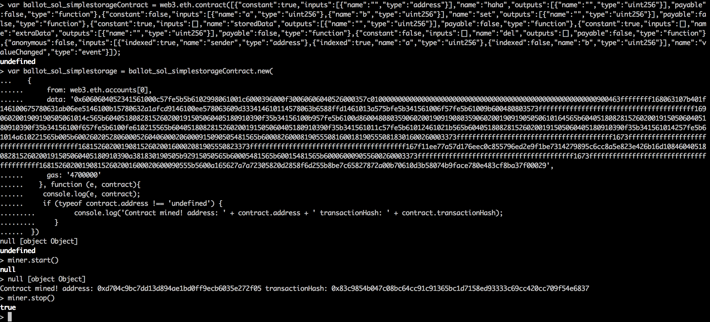

#### 智能合约实战(二)

##### 事件（Event）

*关于事件的详细信息请阅读 https://media.consensys.net/technical-introduction-to-events-and-logs-in-ethereum-a074d65dd61e*

下面是一个简单使用事件机制的智能合约：

```
pragma solidity ^0.4.8;

contract SimpleStorage {
    uint public storedData;
    uint public extraData;
    mapping (address => uint) public haha;
    event valueChanged(address indexed sender, uint indexed a, uint b);
    function set(uint a, uint b) returns (uint) {
        storedData = a;
        haha[msg.sender] = a + b;
        valueChanged(msg.sender, a, b);
        return a + b;
    }
    function del() {
        delete storedData;
        delete haha[msg.sender];
    }
}
```
将该代码粘贴至 https://remix.ethereum.org 得到关于该智能合约的 ABI 等信息，如下：

```
Interface :
[{"constant":true,"inputs":[{"name":"","type":"address"}],"name":"haha","outputs":[{"name":"","type":"uint256"}],"payable":false,"type":"function"},{"constant":false,"inputs":[{"name":"a","type":"uint256"},{"name":"b","type":"uint256"}],"name":"set","outputs":[{"name":"","type":"uint256"}],"payable":false,"type":"function"},{"constant":true,"inputs":[],"name":"storedData","outputs":[{"name":"","type":"uint256"}],"payable":false,"type":"function"},{"constant":true,"inputs":[],"name":"extraData","outputs":[{"name":"","type":"uint256"}],"payable":false,"type":"function"},{"constant":false,"inputs":[],"name":"del","outputs":[],"payable":false,"type":"function"},{"anonymous":false,"inputs":[{"indexed":true,"name":"sender","type":"address"},{"indexed":true,"name":"a","type":"uint256"},{"indexed":false,"name":"b","type":"uint256"}],"name":"valueChanged","type":"event"}]


Web3 deploy :
var ballot_sol_simplestorageContract = web3.eth.contract([{"constant":true,"inputs":[{"name":"","type":"address"}],"name":"haha","outputs":[{"name":"","type":"uint256"}],"payable":false,"type":"function"},{"constant":false,"inputs":[{"name":"a","type":"uint256"},{"name":"b","type":"uint256"}],"name":"set","outputs":[{"name":"","type":"uint256"}],"payable":false,"type":"function"},{"constant":true,"inputs":[],"name":"storedData","outputs":[{"name":"","type":"uint256"}],"payable":false,"type":"function"},{"constant":true,"inputs":[],"name":"extraData","outputs":[{"name":"","type":"uint256"}],"payable":false,"type":"function"},{"constant":false,"inputs":[],"name":"del","outputs":[],"payable":false,"type":"function"},{"anonymous":false,"inputs":[{"indexed":true,"name":"sender","type":"address"},{"indexed":true,"name":"a","type":"uint256"},{"indexed":false,"name":"b","type":"uint256"}],"name":"valueChanged","type":"event"}]);
var ballot_sol_simplestorage = ballot_sol_simplestorageContract.new(
   {
     from: web3.eth.accounts[0],
     data: '0x6060604052341561000c57fe5b5b6102998061001c6000396000f30060606040526000357c0100000000000000000000000000000000000000000000000000000000900463ffffffff168063107b401f146100675780631ab06ee5146100b15780632a1afcd9146100ee578063609d333414610114578063b6588ffd1461013a575bfe5b341561006f57fe5b61009b600480803573ffffffffffffffffffffffffffffffffffffffff1690602001909190505061014c565b6040518082815260200191505060405180910390f35b34156100b957fe5b6100d86004808035906020019091908035906020019091905050610164565b6040518082815260200191505060405180910390f35b34156100f657fe5b6100fe610215565b6040518082815260200191505060405180910390f35b341561011c57fe5b61012461021b565b6040518082815260200191505060405180910390f35b341561014257fe5b61014a610221565b005b60026020528060005260406000206000915090505481565b60008260008190555081600181905550818301600260003373ffffffffffffffffffffffffffffffffffffffff1673ffffffffffffffffffffffffffffffffffffffff16815260200190815260200160002081905550823373ffffffffffffffffffffffffffffffffffffffff167f11ee77a57d176eec0c855796ed2e9f1be7314279895c6cc8a5e823e426b16d10846040518082815260200191505060405180910390a381830190505b92915050565b60005481565b60015481565b600060009055600260003373ffffffffffffffffffffffffffffffffffffffff1673ffffffffffffffffffffffffffffffffffffffff168152602001908152602001600020600090555b5600a165627a7a72305820d2858f6d255b8be7c65827872a00b70610d3b58074b9face780e483cf8ba37f00029',
     gas: '4700000'
   }, function (e, contract){
    console.log(e, contract);
    if (typeof contract.address !== 'undefined') {
         console.log('Contract mined! address: ' + contract.address + ' transactionHash: ' + contract.transactionHash);
    }
 })

Functions :
b6588ffd del()
609d3334 extraData()
107b401f haha(address)
1ab06ee5 set(uint256,uint256)
2a1afcd9 storedData()
```

在 geth console 中进行部署该合约：



部署完毕之后，我们来采用与智能合约实战（一）不同的调用智能合约的方法，并进行 valueChanged 事件的监听：

```
> var myContractInstance = ballot_sol_simplestorageContract.at("0xd704c9bc7dd13d894ae1bd0ff9ecb6035e272f05")
undefined
> myContractInstance.storedData()
0
> myContractInstance.extraData()
0
//当监听到 sender 为 eth.coinbase 并且 a 的值是 100 时，才会输出相关日志信息
> var myValueChangedEvent = myContractInstance.valueChanged({sender : eth.coinbase, a : 100})
undefined
> myValueChangedEvent.watch(function(error, res) {if (!error) {console.log("sender : " + res.args.sender + " a : " + res.args.a);} else {console.log(error);}})
{
  callbacks: [function(error, res)],
  filterId: "0xf3ccf4fd44e9ddea7780fe9fa35a9a35",
  getLogsCallbacks: [],
  implementation: {
    getLogs: function(),
    newFilter: function(),
    poll: function(),
    uninstallFilter: function()
  },
  options: {
    address: "0xd704c9bc7dd13d894ae1bd0ff9ecb6035e272f05",
    from: undefined,
    fromBlock: undefined,
    to: undefined,
    toBlock: undefined,
    topics: ["0x11ee77a57d176eec0c855796ed2e9f1be7314279895c6cc8a5e823e426b16d10", "0x000000000000000000000000a3ac96fbe4b0dce5f6f89a715ca00934d68f6c37", "0x0000000000000000000000000000000000000000000000000000000000000064"]
  },
  pollFilters: [],
  requestManager: {
    polls: {
      0xf3ccf4fd44e9ddea7780fe9fa35a9a35: {
        data: {...},
        id: "0xf3ccf4fd44e9ddea7780fe9fa35a9a35",
        callback: function(error, messages),
        uninstall: function()
      }
    },
    provider: {
      newAccount: function(),
      send: function github.com/ethereum/go-ethereum/console.(*bridge).Send-fm(),
      sendAsync: function github.com/ethereum/go-ethereum/console.(*bridge).Send-fm(),
      sign: function(),
      unlockAccount: function()
    },
    timeout: {},
    poll: function(),
    reset: function(keepIsSyncing),
    send: function(data),
    sendAsync: function(data, callback),
    sendBatch: function(data, callback),
    setProvider: function(p),
    startPolling: function(data, pollId, callback, uninstall),
    stopPolling: function(pollId)
  },
  formatter: function(),
  get: function(callback),
  stopWatching: function(callback),
  watch: function(callback)
}
//发送交易来调用合约的 set 函数，因为 a 的值是 16，所以不会输出日志信息
> miner.start()
> myContractInstance.set.sendTransaction(16, 32, {from : eth.coinbase})
"0x5198bf58f46daf035562129ec5ac3e26c328e202d30a55b0f2be642bccb314fe"
> miner.stop()
true
> myContractInstance.storedData()
16
> myContractInstance.extraData()
32
> personal.unlockAccount(eth.coinbase)
Unlock account 0xa3ac96fbe4b0dce5f6f89a715ca00934d68f6c37
Passphrase:
true
> myContractInstance.set.sendTransaction(100, 1, {from : eth.coinbase})
"0xc79ec4805cba04b95e2632f7dd08ae547dd888072201bf6feabdab2201ad864a"
> miner.start()
null
> sender : 0xa3ac96fbe4b0dce5f6f89a715ca00934d68f6c37 a : 100
> miner.stop()
true
> myContractInstance.storedData()
100
> myContractInstance.extraData()
1
//通过交易哈希查询交易以及收据等信息
> eth.getTransactionReceipt("0xc79ec4805cba04b95e2632f7dd08ae547dd888072201bf6feabdab2201ad864a")
{
  blockHash: "0x506f5f7bb2d6e0336f58e9f4925256338faf1966a293309188d30602b7066adf",
  blockNumber: 251,
  contractAddress: null,
  cumulativeGasUsed: 38882,
  from: "0xa3ac96fbe4b0dce5f6f89a715ca00934d68f6c37",
  gasUsed: 38882,
  logs: [{
      address: "0xd704c9bc7dd13d894ae1bd0ff9ecb6035e272f05",
      blockHash: "0x506f5f7bb2d6e0336f58e9f4925256338faf1966a293309188d30602b7066adf",
      blockNumber: 251,
      data: "0x0000000000000000000000000000000000000000000000000000000000000001",
      logIndex: 0,
      removed: false,
      topics: ["0x11ee77a57d176eec0c855796ed2e9f1be7314279895c6cc8a5e823e426b16d10", "0x000000000000000000000000a3ac96fbe4b0dce5f6f89a715ca00934d68f6c37", "0x0000000000000000000000000000000000000000000000000000000000000064"],
      transactionHash: "0xc79ec4805cba04b95e2632f7dd08ae547dd888072201bf6feabdab2201ad864a",
      transactionIndex: 0
  }],
  logsBloom: "0x00000000000000000000000000000000000000000000000000010000000000000000000000000000000000000000100002010000000000000000000000080000000000000000000000000000000000000000000000000000000000000000000000000000000000002000000000000000000000000000000000000040000000000000000000000000000000000000000000000000000000000000000000000000000000000000400000000000000000000000000000000000000000000000000000000000000000000000000000000000000000000000080000000000000000040002000000000000000000000000000000000000000000008000000000000000",
  root: "0xf76837d5476d02f39867e5bfb71d8cf9893f71596782ba3305c738baff319683",
  to: "0xd704c9bc7dd13d894ae1bd0ff9ecb6035e272f05",
  transactionHash: "0xc79ec4805cba04b95e2632f7dd08ae547dd888072201bf6feabdab2201ad864a",
  transactionIndex: 0
}
> eth.getTransaction("0xc79ec4805cba04b95e2632f7dd08ae547dd888072201bf6feabdab2201ad864a")
{
  blockHash: "0x506f5f7bb2d6e0336f58e9f4925256338faf1966a293309188d30602b7066adf",
  blockNumber: 251,
  from: "0xa3ac96fbe4b0dce5f6f89a715ca00934d68f6c37",
  gas: 90000,
  gasPrice: 20000000000,
  hash: "0xc79ec4805cba04b95e2632f7dd08ae547dd888072201bf6feabdab2201ad864a",
  input: "0x1ab06ee500000000000000000000000000000000000000000000000000000000000000640000000000000000000000000000000000000000000000000000000000000001",
  nonce: 5,
  r: "0xb22fc40a72099401249bcb60d0fb63f78e75b17aed4e60e6b642a319f5bb8a6a",
  s: "0x5a9719f9d9e29d5d26e332e991c0e4e7822ee74386fef68fbfb298d35381ce9a",
  to: "0xd704c9bc7dd13d894ae1bd0ff9ecb6035e272f05",
  transactionIndex: 0,
  v: "0x41",
  value: 0
}
```
交易收据各字段的意思是：
```
Returns

Object - A transaction receipt object, or null when no receipt was found:

blockHash: String, 32 Bytes - hash of the block where this transaction was in.
blockNumber: Number - block number where this transaction was in.
transactionHash: String, 32 Bytes - hash of the transaction.
transactionIndex: Number - integer of the transactions index position in the block.
from: String, 20 Bytes - address of the sender.
to: String, 20 Bytes - address of the receiver. null when its a contract creation transaction.
cumulativeGasUsed: Number - The total amount of gas used when this transaction was executed in the block.
gasUsed: Number - The amount of gas used by this specific transaction alone.
contractAddress: String - 20 Bytes - The contract address created, if the transaction was a contract creation, otherwise null.
logs: Array - Array of log objects, which this transaction generated.
```
上面获取到的交易收据中有 logs 与 logsBloom 两项，其中 logs 中有 topics，topics 最多有 3 个元素，第一个元素是合约事件函数的 keccak256 哈希值，即
```
> web3.sha3("valueChanged(address,uint256,uint256)")
"0x11ee77a57d176eec0c855796ed2e9f1be7314279895c6cc8a5e823e426b16d10"
```
第二个元素是合约事件函数中第一个使用 indexed 关键字标记的 sender，第三个元素是 a，由于 b 未被 indexed 关键字标记（即使被标记，也不好使，因为 topics 只能容纳 3 个元素），所以 b 位于 logs 中的 data 字段。logsBloom 由 logs 中的 address 与 topics 共同决定，详细请看以太坊黄皮书，作用是便于快速查找监听的事件是否在该交易中产生。

利用智能合约实战（一）中提到的脚本，获取现在区块链底层存储的数据：

```
> web3.sha3("0xd704c9bc7dd13d894ae1bd0ff9ecb6035e272f05", {"encoding" : "hex"})
"0xae795730ce8c58473c4c4cdfd0ad09fa4f372ee9e96cb9c395c241111e341569"
```

```
➜  /Users/likang/private_ethereum  >>python detect_internal_storage.py ad812fb06fc580a18820c0b44fda887517cc903b4217e83e02c26d8926499a96
568b1c89f37932c37da09b86b2f54d98967b44cadc58173afcb890af3cbf426d :  ['\x01', '', "\xa22,\xea&\xfbg\xb3e9J~\x83\xdeLJ'B\x0c\x10\x15\xf2\xd9\xe8\xb3\xe7!8\xd0\xf5\xde\xdf", '6\x04\x84\xe2\xe9d\x1ba\xe4\xb9D\x86\xd8\xb9H\xe7\xf6I\xab \x8e\xac\xab\x98A-\x92h\x95\xe0o\x15']

727522965583e311a2ddb8b3499955ef767018cc1dcb47922697fc481f31bb82 :  ['\x06', 'C}\xd8\x87\xb5\x11T\x00\x00', 'V\xe8\x1f\x17\x1b\xccU\xa6\xff\x83E\xe6\x92\xc0\xf8n[H\xe0\x1b\x99l\xad\xc0\x01b/\xb5\xe3c\xb4!', "\xc5\xd2F\x01\x86\xf7#<\x92~}\xb2\xdc\xc7\x03\xc0\xe5\x00\xb6S\xca\x82';{\xfa\xd8\x04]\x85\xa4p"]

ae795730ce8c58473c4c4cdfd0ad09fa4f372ee9e96cb9c395c241111e341569 :  ['\x01', '', '\xc8D\x02{Lwhf\x03\xcdA\x9f\xd7V\x0f7\xf9\x01HsS\xf7\x8e\xb2Hc\xc6\xe0\x80\x97\xa90', '+\xcdYT\x1b\x84\xae~\x00d\x11\xce3\xccnx\x0f\xe8\xdd\xa2`\xb06\xe6K\x03\xed\xf4\x16\xa8T\xcc']

75cd2892199f9be180f5ae96b181d9cb5aba7118581d1b250cd2849fa6d3771f :  ['', '\x8a\xc7#\x04\x89\xe8\x00\x00', 'V\xe8\x1f\x17\x1b\xccU\xa6\xff\x83E\xe6\x92\xc0\xf8n[H\xe0\x1b\x99l\xad\xc0\x01b/\xb5\xe3c\xb4!', "\xc5\xd2F\x01\x86\xf7#<\x92~}\xb2\xdc\xc7\x03\xc0\xe5\x00\xb6S\xca\x82';{\xfa\xd8\x04]\x85\xa4p"]

➜  /Users/likang/private_ethereum  >>ipython
Python 2.7.13 (default, May  4 2017, 09:45:36)
Type "copyright", "credits" or "license" for more information.

IPython 5.3.0 -- An enhanced Interactive Python.
?         -> Introduction and overview of IPython's features.
%quickref -> Quick reference.
help      -> Python's own help system.
object?   -> Details about 'object', use 'object??' for extra details.

In [1]: '\xc8D\x02{Lwhf\x03\xcdA\x9f\xd7V\x0f7\xf9\x01HsS\xf7\x8e\xb2Hc\xc6\xe0\x80\x97\xa90'.encode("hex")
Out[1]: 'c844027b4c77686603cd419fd7560f37f901487353f78eb24863c6e08097a930'

➜  /Users/likang/private_ethereum  >>python detect_internal_storage.py c844027b4c77686603cd419fd7560f37f901487353f78eb24863c6e08097a930
35769f93790013def002a4a48146e8e4fbe475fb2a1b90f50429da4bca166765 :  e

290decd9548b62a8d60345a988386fc84ba6bc95484008f6362f93160ef3e563 :  d

b10e2d527612073b26eecdfd717e6a320cf44b4afac2b0732d9fcbe2b7fa0cf6 :
```
上述的 3 个 key 是这样得到的：
```
// storedData 的 position 是 0
> web3.sha3("0000000000000000000000000000000000000000000000000000000000000000", {"encoding" : "hex"})
"0x290decd9548b62a8d60345a988386fc84ba6bc95484008f6362f93160ef3e563"
// extraData 的 position 是 1
> web3.sha3("0000000000000000000000000000000000000000000000000000000000000001", {"encoding" : "hex"})
"0xb10e2d527612073b26eecdfd717e6a320cf44b4afac2b0732d9fcbe2b7fa0cf6"
// map 的 position 是 2，且 key 是 eth.coinbase
> eth.coinbase
"0xa3ac96fbe4b0dce5f6f89a715ca00934d68f6c37"
> var left = "000000000000000000000000a3ac96fbe4b0dce5f6f89a715ca00934d68f6c37"
undefined
> var right = "0000000000000000000000000000000000000000000000000000000000000002"
undefined
> web3.sha3(web3.sha3(left+right, {"encoding" : "hex"}), {"encoding" : "hex"})
"0x35769f93790013def002a4a48146e8e4fbe475fb2a1b90f50429da4bca166765"
```
与预期结果相符~ bingo~
